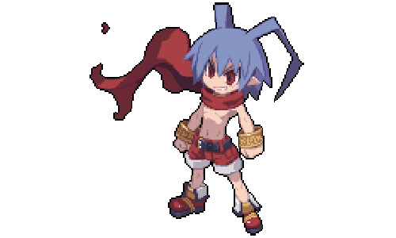

<html>

<h1 align="center" style="font-size: 22px"> 👋 (っ◔◡◔)っ 𝖜𝖊𝖑𝖈𝖔𝖒𝖊 𝖙𝖔 𝖒𝖞 𝖌𝖎𝖙𝖍𝖚𝖇 👋 </h1>

  

<h1 align="center" style="font-size: 22px"> 👩‍💻 𝔞𝔟𝔬𝔲𝔱 𝔪𝔢 👩‍💻 </h1>

  
Hi, I'm Rambling! I'm a 16-year-old backend developer based out of the U.S.

   
  
  <li><b>:woman_technologist: I'm currently working on<a href="https://twitter.com/AkariAutomation"></b> Akari Automation </a>, which is a piece of software that checks out products on retail sites. </li>
  <li><b>🤩 I'm currently learning</b> GoLang; however, I'm proficient in C#.</li>
  <li><b>😄 Pronouns:</b> she/her </li> 
   
  I've been in love with computers and how they work since I was young. I started developing small programs when I was ten years old. Since then, I've improved a lot! I love to learn new languages and pick them up relatively quickly.

  
<h2 align="center" style="font-size: 22px"> ✍️ 𝖈𝖔𝖓𝖙𝖆𝖈𝖙 𝖒𝖊 ✍️ </h2>

  <strong><a href="https://twitter.com/shopifyraffle">Twitter</a></strong> |
  <strong><a href="https://discord.bio/p/rambling">Discord</a></strong> |
  <strong><a href="https://www.twitch.tv/rambling">Twitch</a></strong>

<h2 align="center" style="font-size: 22px"> 🎧 𝖂𝖍𝖆𝖙 𝖎𝖒 𝖑𝖎𝖘𝖙𝖊𝖓𝖎𝖓𝖌 𝖙𝖔 🎧 </h2>
 

  

  

<h2 align="center" style="font-size: 22px"> 💙 𝖙𝖍𝖆𝖓𝖐 𝖞𝖔𝖚 𝖋𝖔𝖗 𝖗𝖊𝖆𝖉𝖎𝖓𝖌 💙 </h2>

  

</html>